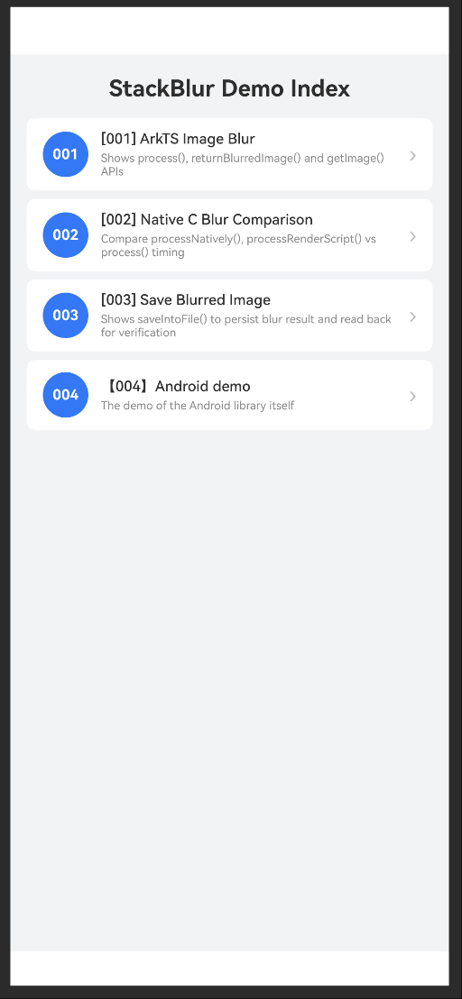

<div align="center">

# stackblur

</div>

本项目基于 [android-stackblur](https://github.com/kikoso/android-stackblur) 开发。

## 简介

stackblur 是一个适用于 OpenHarmony 的图像模糊库，基于 Mario Klingemann 的 StackBlur 算法实现。可对 PixelMap 图像按指定半径执行高质量模糊效果。

## 效果展示



## 下载安装

```bash
ohpm install @ohos/stackblur
```

OpenHarmony ohpm 环境配置等更多内容，请参考[如何安装 OpenHarmony ohpm 包](https://gitcode.com/openharmony-tpc/docs/blob/master/OpenHarmony_har_usage.md)。

## 约束与限制

### 兼容性

在下述版本验证通过：

- DevEco Studio: 6.0.1 Beta1(6.0.1.103), SDK: API20(6.0.0.20), ROM: 5.1.0.120；

### 权限要求

无

## 使用示例

```typescript
import { StackBlurManager } from '@ohos/stackblur';
import { image } from '@kit.ImageKit';

@Entry
@Component
struct BlurDemoPage {
  @State private blurredPixelMap: image.PixelMap | null = null;
  @State private statusText: string = '';

  // 原始图像字节（从资源加载后缓存，避免重复 I/O）
  private imageBytes: ArrayBuffer | null = null;

  aboutToAppear(): void {
    // 预加载图像字节
    const bytes: Uint8Array = getContext(this).resourceManager
      .getMediaContentSync($r('app.media.test_image').id);
    this.imageBytes = bytes.buffer as ArrayBuffer;
  }

  // 执行模糊
  private applyBlur(radius: number): void {
    if (this.imageBytes === null) {
      return;
    }
    image.createImageSource(this.imageBytes)
      .createPixelMap({ editable: true, desiredPixelFormat: image.PixelMapFormat.BGRA_8888 })
      .then((pm: image.PixelMap) => {
        // 创建 StackBlurManager 并执行模糊
        const manager = new StackBlurManager(pm);
        const blurred: image.PixelMap = manager.processNatively(radius);
        this.blurredPixelMap = blurred;
        this.statusText = `模糊完成，半径：${radius}`;
      });
  }

  build() {
    Column({ space: 16 }) {
      Text(this.statusText)
      Image(this.blurredPixelMap)
        .width(300)
        .height(300)
        .objectFit(ImageFit.Contain)
      Button('执行模糊（radius=25）')
        .onClick(() => this.applyBlur(25))
    }
    .padding(16)
    .width('100%')
  }
}
```

## 使用说明

> **重要说明**：`process()`、`processNatively()` 和 `processRenderScript()` 三个方法内部均调用 Native C 高性能实现，本质上完全等价。提供三个方法是为了保持与原 Android 版本 API 的兼容性，方便从 Android 项目迁移。

### 1. 使用 process() 方法

```typescript
import { StackBlurManager } from '@ohos/stackblur';
import { image } from '@kit.ImageKit';

// 将图像解码为可编辑的 PixelMap
const bytes: Uint8Array = getContext(this).resourceManager
  .getMediaContentSync($r('app.media.test_image').id);
image.createImageSource(bytes.buffer as ArrayBuffer)
  .createPixelMap({ editable: true, desiredPixelFormat: image.PixelMapFormat.BGRA_8888 })
  .then((pm: image.PixelMap) => {
    const manager = new StackBlurManager(pm);
    // radius 范围 1–254
    const blurred: image.PixelMap = manager.process(25);
  });
```

### 2. 使用 processNatively() 方法

与 `process()` 完全等价，方法名更直观地表达了使用 Native 实现：

```typescript
import { StackBlurManager } from '@ohos/stackblur';
import { image } from '@kit.ImageKit';

const bytes: Uint8Array = getContext(this).resourceManager
  .getMediaContentSync($r('app.media.test_image').id);
image.createImageSource(bytes.buffer as ArrayBuffer)
  .createPixelMap({ editable: true, desiredPixelFormat: image.PixelMapFormat.BGRA_8888 })
  .then((pm: image.PixelMap) => {
    const manager = new StackBlurManager(pm);
    const blurred: image.PixelMap = manager.processNatively(25);
  });
```

### 3. RenderScript 兼容 API（Android 迁移场景）

从 Android 迁移时可使用 `processRenderScript()`，内部与 `process()` 和 `processNatively()` 完全等价：

```typescript
import { StackBlurManager } from '@ohos/stackblur';
import { image } from '@kit.ImageKit';
import { common } from '@kit.AbilityKit';

const context: common.UIAbilityContext = getContext(this) as common.UIAbilityContext;
const bytes: Uint8Array = context.resourceManager
  .getMediaContentSync($r('app.media.test_image').id);
image.createImageSource(bytes.buffer as ArrayBuffer)
  .createPixelMap({ editable: true, desiredPixelFormat: image.PixelMapFormat.BGRA_8888 })
  .then((pm: image.PixelMap) => {
    const manager = new StackBlurManager(pm);
    // context 参数保留以兼容 Android 原版 API，内部实际使用 NativeBlurProcess
    const blurred: image.PixelMap = manager.processRenderScript(context, 25);
  });
```

### 4. 获取模糊结果与原始图像

```typescript
const manager = new StackBlurManager(pm);

// 执行模糊前，returnBlurredImage() 返回 null
const beforeBlur: image.PixelMap | null = manager.returnBlurredImage(); // null

// 执行模糊
manager.processNatively(25);

// 获取最近一次模糊结果
const blurred: image.PixelMap | null = manager.returnBlurredImage(); // 有效 PixelMap

// 获取构造时传入的原始未修改图像
const original: image.PixelMap = manager.getImage();
```

### 5. 将模糊结果保存为文件

```typescript
import { StackBlurManager } from '@ohos/stackblur';
import { image } from '@kit.ImageKit';

const filesDir: string = getContext(this).filesDir;
const outputPath: string = filesDir + '/stackblur_output.png';

const bytes: Uint8Array = getContext(this).resourceManager
  .getMediaContentSync($r('app.media.test_image').id);
image.createImageSource(bytes.buffer as ArrayBuffer)
  .createPixelMap({ editable: true, desiredPixelFormat: image.PixelMapFormat.BGRA_8888 })
  .then((pm: image.PixelMap) => {
    const manager = new StackBlurManager(pm);
    manager.processNatively(25);
    // 将模糊结果以 PNG 格式保存到应用沙箱，path 须为沙箱内的路径
    manager.saveIntoFile(outputPath);
  });
```

> 注意：`saveIntoFile()` 在未执行过任何模糊时直接返回，不会写入文件。请确保在调用 `saveIntoFile()` 前已执行过 `process()`、`processNatively()` 或 `processRenderScript()`。

## 接口说明

### API

| 名称 | 描述 | 类型 | 参数 | 返回值 |
|------|------|------|------|--------|
| `constructor` | 创建 StackBlurManager 实例，初始化待处理的 PixelMap | 构造函数 | `pixelMap: image.PixelMap` | - |
| `process` | 使用 Native C 高性能实现对图像进行模糊处理，半径须至少为 1 | 方法 | `radius: number` | `image.PixelMap` |
| `processNatively` | 使用 Native C 高性能实现对图像进行模糊处理，与 `process()` 完全等价 | 方法 | `radius: number` | `image.PixelMap` |
| `processRenderScript` | 使用 Native C 高性能实现进行模糊处理，`context` 参数保留以兼容 Android 原版 API，与 `process()` 完全等价 | 方法 | `context: common.Context, radius: number` | `image.PixelMap` |
| `returnBlurredImage` | 返回最近一次模糊处理的结果图像，未执行过模糊时返回 `null` | 方法 | - | `image.PixelMap \| null` |
| `getImage` | 返回构造时传入的原始未修改图像 | 方法 | - | `image.PixelMap` |
| `saveIntoFile` | 将最近一次模糊结果以 PNG 格式保存到指定文件路径 | 方法 | `path: string` | `void` |

#### 参数说明

| 参数名 | 类型 | 必填 | 取值范围 | 描述 |
|--------|------|------|---------|------|
| `pixelMap` | `image.PixelMap` | 是 | - | 待模糊处理的源图像，需设置 `editable: true` |
| `radius` | `number` | 是 | 1–254 | 模糊半径，值越大模糊程度越深 |
| `context` | `common.Context` | 是 | - | 仅为兼容 Android 原版接口保留，内部实际未使用 |
| `path` | `string` | 是 | - | 应用沙箱内的路径，如 `context.filesDir + '/output.png'` |

## 关于混淆

在对应模块下的 `obfuscation-rules.txt` 文件中添加如下配置：

```
-keep ./oh_modules/@ohos/stackblur
```

## 目录结构

```
HO_stackblur
├── AppScope                      # 应用级资源与配置
├── entry                         # Demo 入口模块
│   └── src/main/ets/pages        # Demo 页面
├── library                       # 核心库模块（HAR）
│   ├── Index.ets                 # 库入口，导出 StackBlurManager
│   └── src/main
│       ├── ets/stackblur         # ArkTS 核心实现
│       │   ├── StackBlurManager.ets   # 主入口类
│       │   ├── BlurProcess.ets        # 内部接口定义
│       │   ├── JSBlurProcess.ets      # ArkTS 模糊实现（保留用于接口兼容）
│       │   └── NativeBlurProcess.ets  # Native C 模糊调用封装
│       └── cpp                   # Native C 模糊算法实现
└── oh_modules                    # 依赖模块
```

## 贡献代码

使用过程中发现任何问题，请提 Issue 或 PR。

## 开源协议

本项目基于 [Apache License 2.0](https://www.apache.org/licenses/LICENSE-2.0.txt) ，请自由地享受和参与开源。
